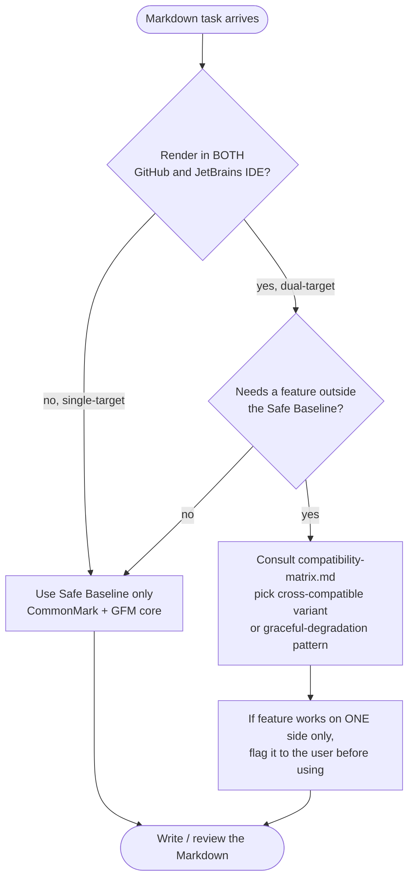

# Markdown for JetBrains IDE + GitHub

## Who this skill is for

Someone writing Markdown that will be **read in at least two places**:

1. **JetBrains IDE Markdown preview** (IntelliJ IDEA, PyCharm, GoLand, WebStorm, Rider, RustRover, CLion, Writerside) — using the bundled Markdown plugin (intellij-markdown / flexmark backend), the bundled Mermaid extension, and optionally the Markdown Navigator plugin.
2. **GitHub web renderer** — README on the repo page, Gists, Issues, PRs, Wiki, Discussions, GitHub Pages (Jekyll/`github-markdown.css`).

The two renderers **agree on CommonMark and most of GFM**, but they diverge in ways that quietly break documents. The skill exists to keep authoring decisions inside the safe overlap, and to flag features that work in only one environment.

## Environment assumptions — read this before doing anything else

These are not negotiable. They are facts about the user's setup; do not waste tokens hedging on them or instructing the user to install/enable anything.

1. **Mermaid is installed and enabled** in the user's JetBrains IDE. Write ```` ```mermaid ```` fences freely. Do **not** add "you'll need to install the Mermaid plugin" or "enable Markdown Extensions → Mermaid" notes. The user already did that.

2. **PlantUML is forbidden.** Not "discouraged", not "push back and convert" — outright forbidden. Never emit ```` ```plantuml ```` fences. Never emit `@startuml` / `@enduml`. Never propose a PlantUML proxy server, a PlantUML jar download, or a "keep PlantUML in IDE, render via image on GitHub" hybrid. If the user explicitly asks for PlantUML, refuse it, explain in one sentence that this skill only emits Mermaid, and convert. The same rule applies to DOT/D2/drawio/TikZ source fences — convert to Mermaid or pre-render to PNG/SVG and embed via ``.

3. **Math is always LaTeX.** Every mathematical expression, every formula, **and every individual mathematical character used in a mathematical sense** (a learning rate `α`, a sum `Σ`, an integral `∫`, a complexity `O(n log n)`, a limit `n → ∞`, a comparison `≤`, a fraction `½`, a subscript `xᵢ`) must be written in LaTeX inside `$…$` or `$$…$$`. Never substitute raw Unicode for LaTeX commands inside math. The only exceptions are proper nouns and Mermaid diagram labels — see `references/math.md` for the precise scope.

## Why this skill exists

> "It looks fine in my IDE."

Then the PR ships, GitHub renders the README, and the alert callout is a quoted blockquote, the Mermaid diagram is text, the LaTeX is `$x_i$` literal text, the footnote is missing, and the table column widths jump.

These mismatches share a root cause: **CommonMark is a shared core, but everything around it (alerts, diagrams, math, footnotes, anchors, HTML allowlist) is per-renderer.** Authors writing from memory tend to either:

- **Over-trust GitHub-only syntax** (`> [!NOTE]`, `$$math$$` in headings, ` ```mermaid `, `:emoji:`) → JetBrains preview shows nothing or shows raw source.
- **Over-trust JetBrains plugin syntax** (non-Mermaid diagram fences such as PlantUML/DOT/D2, custom admonitions, certain LaTeX environments) → GitHub shows a literal code block.
- **Over-trust raw HTML** → GitHub's sanitizer strips `style`, `class`, `id`, most event handlers, `<script>`, `<iframe>`, `<form>`, and some attributes; JetBrains keeps them.

This skill turns "render-compatible Markdown" into a deliberate choice rather than guesswork.

## When to invoke

Invoke when **any** of these are true:

- The user is creating, editing, or fixing a `.md`/`.mdx`/`.markdown` file.
- The user pastes Markdown and asks why it "looks wrong" or "doesn't render".
- The user is generating a README, CHANGELOG, RFC, design doc, or contribution guide for a public repo.
- The user references both "preview" (IDE) and "GitHub" in the same request.
- The user asks to convert from another Markdown flavor (Obsidian, Notion export, MkDocs, Docusaurus, Hugo) to "GitHub-flat" or "IDE-friendly" Markdown.

Skip when:

- Editing a single typo / single-line text in prose where no Markdown construct is involved.
- The file is a fenced-code-block payload (i.e. the user is editing code that happens to live inside a Markdown file).
- The user explicitly targets a third renderer only (e.g. `pandoc` → PDF) and has stated they don't care about GitHub or IDE preview.

## Decision flow



## The Safe Baseline

These constructs render identically on GitHub and in JetBrains' bundled Markdown plugin. Default to them.

- ATX headings `#`–`######` (skip Setext underline — anchor IDs differ)
- Paragraphs separated by blank lines
- Bold `**x**`, italic `*x*`, strikethrough `~~x~~`, inline code `` `x` ``
- Unordered lists `- ` and ordered lists `1.` with 2- or 4-space child indent
- Task lists `- [ ]` / `- [x]` (GFM, both render)
- Fenced code blocks with language id: ```` ```python ```` (both apply syntax highlighting; JetBrains additionally **injects** the real language parser for completion & inspections)
- Tables (GFM pipe tables, with leading/trailing pipes optional)
- Block quotes `>` (one level — see Gotchas for nested-quote alert collisions)
- Inline links `[text](url)` and reference links `[text][ref]`
- Inline images `` with **relative repo paths**
- Autolinks `<https://...>`
- Horizontal rule `---` on its own line, blank line above and below
- HTML comments `<!-- ... -->` (both hide; useful for TOC markers, pragmas)

Anything else — consult the compatibility matrix before using.

## What diverges (high-impact list)

Treat each of these as a deliberate decision, not a default.

1. **Alerts / Callouts.** GitHub renders `> [!NOTE]`, `> [!TIP]`, `> [!IMPORTANT]`, `> [!WARNING]`, `> [!CAUTION]` as styled callouts. JetBrains shows them as ordinary blockquotes with the literal `[!NOTE]` text. Use only if "blockquote with prefix" is acceptable in the IDE, OR provide an HTML fallback. See `references/github-specific.md`.

2. **Diagrams — Mermaid only, PlantUML forbidden.** Mermaid is the only diagram backend this skill emits. The user has Mermaid installed (see Environment assumptions above) — write fences directly, no install instructions. PlantUML, DOT, D2, drawio source fences, and TikZ are **forbidden**: refuse and convert to Mermaid. If a diagram genuinely cannot be expressed in Mermaid, pre-render to PNG/SVG, commit the image, and embed via `` — but never put non-Mermaid source DSL into a code fence. Caveat for bleeding-edge Mermaid types (`block-beta`, `architecture-beta`): GitHub's bundled Mermaid version may differ from the IDE's; prefer stable diagram types if dual-render parity matters.

3. **Math — LaTeX is mandatory, no Unicode substitutes.** Every formula, every expression, **and every single mathematical character used in a mathematical sense** goes inside `$…$` or `$$…$$` LaTeX. Examples that must each become LaTeX: `α` (learning rate) → `$\alpha$`; `Σ x` → `$\sum x$`; `O(n log n)` → `$O(n \log n)$`; `n → ∞` → `$n \to \infty$`; `½` → `$\tfrac{1}{2}$`; `xᵢ` → `$x_i$`; `≤ ≥ ≠` → `$\leq$`, `$\geq$`, `$\neq$`. Four iron rules in both renderers:
   - No whitespace adjacent to inline `$` delimiters (`$ x $` ❌ → `$x$` ✅).
   - Block `$$ … $$` is its own paragraph with blank lines above and below.
   - Escape literal `\$` if the document mentions prices.
   - Pipe `|` inside a formula inside a table cell breaks the table — escape as `\|` or move the math out of the cell.
   - **Never** put math inside a heading.
   - Full policy, exceptions (proper nouns, Mermaid labels), and supported environments live in `references/math.md`.

4. **Footnotes.** GitHub supports `[^1]` definitions and references (GFM extension). JetBrains' bundled plugin supports footnotes only with the Markdown Navigator extension or via flexmark configuration. For dual-target documents, footnotes are usually safe on the GitHub side but may render as literal `[^1]` in some IDE setups — verify before relying on them.

5. **Heading anchors / TOC links.** Anchor slug algorithms differ:
   - GitHub: lowercase, spaces → `-`, strip most punctuation, append `-N` for duplicates.
   - JetBrains: similar but **not identical** for non-ASCII headings, emoji in headings, and headings containing inline code.
   - For dual-target TOCs, prefer explicit HTML anchor `<a id="explicit-id"></a>` placed just before the heading.

6. **Emoji shortcodes.** GitHub converts `:smile:` to emoji. JetBrains shows literal text unless the Emoji or Markdown Navigator plugin is installed. Use **Unicode emoji** directly (🙂) for cross-renderer parity.

7. **Raw HTML.** GitHub sanitizes aggressively (no `<script>`, `<style>`, `<iframe>`, `<form>`, `onclick`, `id`, `class` on most elements, `style` stripped). JetBrains preview is closer to a real browser and renders almost everything. **Author for GitHub's sanitizer**; the IDE will always render at least as much. Safe HTML elements: `<details>`/`<summary>`, `<sub>`/`<sup>`, `<kbd>`, `<br>`, `` with allowed attrs, `<a>` with `href`/`title`, `<table>`/`<tr>`/`<td>`, `<picture>`/`<source>` for theme-aware images.

8. **Diff code blocks.** Both support ```` ```diff ````. Both apply red/green coloring. Safe.

9. **Definition lists / abbreviations / superscript syntax `^x^` / subscript `~x~`.** Pandoc / kramdown extensions — **neither** GitHub nor stock JetBrains render these. Use `<sub>`/`<sup>` HTML instead.

10. **YAML front matter** (`--- ... ---` at top of file). GitHub Pages / Jekyll: parsed and hidden. Plain GitHub repo view: rendered as a horizontal-rule-bounded section (looks ugly). JetBrains: hidden in preview, treated as YAML for completion. If the file is not a Jekyll source, **prefer no front matter, or put it after a hidden HTML comment**.

11. **Line breaks.** Single newline → space (CommonMark). Both renderers respect this. For a hard break, use **two trailing spaces** or `\` at line end (GFM); both work. Avoid `<br>` inside lists — see Gotchas.

## How to use this skill in practice

When the user gives you a Markdown task, follow this order:

1. **Read what they have** (or sketch what they want).
2. **Identify the renderers** — is this dual-target? Single-target? If they don't say, default to dual-target for any file inside a Git repo with a GitHub remote, otherwise ask.
3. **Spot diverging constructs** using the high-impact list above and `references/compatibility-matrix.md`. For each:
   - If a Safe Baseline equivalent exists, prefer it.
   - If the feature is essential and only works on one side, surface this to the user explicitly: "This will render as a callout on GitHub but as a plain blockquote in your IDE — OK?"
   - If a graceful-degradation pattern exists (e.g. HTML fallback for alerts, pre-rendered image for non-Mermaid diagrams), apply it.
4. **Write or fix the Markdown.** When in doubt, reach for HTML (`<details>`, `<sub>`, `<sup>`, `<kbd>`, `<picture>`) — it's the most predictable cross-renderer fallback.
5. **Sanity-check against Gotchas** (`references/gotchas.md`) before declaring done — especially for tables, nested lists with code blocks, and images with relative paths.

## Math and characters

These two areas concentrate the renderer divergences enough to deserve their own references. Reach for them whenever the document involves formulas, escape-heavy prose, non-ASCII text, or anything that touches Unicode boundaries.

- **Math (LaTeX) → `references/math.md`.** Authoritative source for the **LaTeX-only policy**, delimiter rules, the four iron rules (`$x$` no whitespace, `$$x$$` own paragraph, escape literal `$`, no pipes in tables), supported LaTeX environments on each renderer, `\newcommand` scoping, and the two forbidden positions (tables and headings). **Mathematical content is always LaTeX inside `$…$` or `$$…$$` — never raw Unicode Greek letters (α, β, Σ), operators (∑, ∫, ≤, →), or fractions (½) as substitutes for LaTeX commands.** Open `math.md` whenever the user writes anything that looks like a formula.

- **Characters / escapes / encoding → `references/characters.md`.** Authoritative source for the CommonMark backslash-escape set, HTML entity decisions (`&nbsp;` is the workhorse), smart-quote handling, emoji as Unicode rather than `:shortcode:`, non-ASCII headings and the explicit-anchor rule, zero-width/BOM detection, CJK + ASCII spacing, line endings, and per-context escape behavior. Open this whenever the user writes Markdown that mixes scripts, contains hand-typed special characters, or has come from a paste of external content.

These two files **override** any older guidance in `github-specific.md` or scattered mentions elsewhere in the skill. If they disagree, math.md / characters.md win.

## Reference files

Reach for these when the situation calls for them. Don't preload everything.

- `references/compatibility-matrix.md` — Side-by-side table for every commonly-used Markdown feature: GitHub, JetBrains-native, JetBrains-with-plugin. **Open this whenever a feature is outside the Safe Baseline.**
- `references/math.md` — All math / LaTeX guidance: the LaTeX-only policy, delimiters, supported environments, macro scope, forbidden positions. **Single source of truth for math. No Unicode math symbols.**
- `references/characters.md` — All character / escape / encoding guidance: backslash escapes, HTML entities, smart quotes, emoji, Unicode in headings, zero-width detection, CJK spacing. **Single source of truth for characters.**
- `references/github-specific.md` — Deep dive on GFM alerts, Mermaid, allowed HTML allowlist, anchor algorithm, theme-aware images via `<picture>`, file-link conventions, mentions/refs/emoji autolinks. (Math content has moved to `math.md`.)
- `references/jetbrains-specific.md` — Bundled Markdown plugin features, the bundled Mermaid extension, language injection, what works only with Markdown Navigator. Diagram backends other than Mermaid are intentionally excluded.
- `references/gotchas.md` — Concrete failure modes with before/after fixes: HTML-in-list paragraphing, pipe escaping, image path resolution, math in tables, list-item code-block indentation, hard-break ambiguity, heading-anchor collisions.

## Output style

When you produce or modify Markdown, also produce a short **render note** if you used anything outside the Safe Baseline. Format:

```
Renders:
- GitHub: <ok | downgraded — explain> 
- JetBrains preview: <ok | requires plugin X | downgraded — explain>
```

If everything you wrote is inside the Safe Baseline, omit the render note — silence means "renders the same in both".

## What this skill is NOT

- Not a generic prose-writing assistant. It does not opine on tone, structure, or content quality.
- Not a linter — it doesn't enforce style rules like line length, ATX vs. Setext, or list bullet character. Adapt to the existing file's conventions.
- Not a converter for Obsidian/Notion/Confluence-specific syntax beyond what GitHub or JetBrains accept. If the user needs `[[wikilinks]]` to work, say so explicitly.
