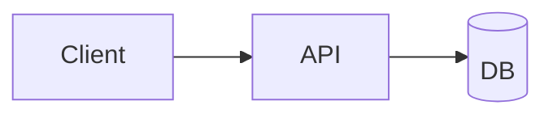

# GitHub Markdown — specifics

GitHub renders Markdown with **cmark-gfm** (a fork of cmark with the GFM extensions), then runs a post-processor that adds GitHub-only features (alerts, autolinks for `@user`/`#123`, emoji shortcodes, theme-aware images, Mermaid). The HTML output is then passed through a sanitizer that strips dangerous or unstyled tags before being wrapped in `github-markdown.css`.

Read this when working on GitHub-targeted features that are not in the Safe Baseline.

## Table of contents

- [Alerts (`> [!NOTE]`)](#alerts)
- [Mermaid](#mermaid)
- [Math](#math) — moved to `math.md`; pointer remains
- [Footnotes](#footnotes)
- [Heading anchors](#heading-anchors)
- [HTML allowlist & sanitizer](#html-allowlist)
- [Theme-aware images](#theme-aware-images)
- [File / line linking conventions](#file-linking)
- [Mentions, refs, emoji](#mentions-refs-emoji)
- [Tables: edge cases](#tables)

## <a id="alerts"></a>Alerts

Syntax:

```markdown
> [!NOTE]
> Body text. Can span multiple lines.
> More body.

> [!TIP]
> …

> [!IMPORTANT]
> …

> [!WARNING]
> …

> [!CAUTION]
> …
```

Rules:
- The marker `[!TYPE]` must be on **the first line of a blockquote**, alone, in **uppercase**.
- One alert per blockquote — you can't chain `[!NOTE]` then `[!TIP]` in one quote.
- Body lines must all start with `>` like a normal blockquote.
- Renders as a colored callout with an icon on GitHub. On a stock JetBrains preview it renders as a regular blockquote with the literal `[!NOTE]` text visible.

Dual-target fallback pattern when you can't accept the IDE-side literal text:

```markdown
> **Note** — body text here. This renders as a plain blockquote
> with a bold "Note" label everywhere, including the IDE.
```

## <a id="mermaid"></a>Mermaid

GitHub natively renders these:

````markdown

````

Supported diagram types on GitHub (as of cutoff): flowchart, sequenceDiagram, classDiagram, stateDiagram, erDiagram, journey, gantt, pie, gitGraph, requirementDiagram, mindmap, timeline, quadrantChart, sankey, xychart, C4 (limited). New types (`block-beta`, `architecture-beta`, etc.) may not yet be on the GitHub server's Mermaid version — verify on a test repo first.

Constraints:
- The diagram source goes inside a code fence with language `mermaid`. Lowercase.
- Don't put HTML or Markdown inside the fence — it's parsed as Mermaid only.
- Long node labels: use `"quoted strings"` to include spaces, hyphens, etc.
- For very large diagrams that hit the size limit, GitHub shows "Diagram too large" — break into smaller diagrams.

For dual-target with JetBrains, ensure the user installs the **Mermaid plugin** (plugin ID `20146-mermaid` or `29870-mermaid-studio`). Without it, the IDE shows the source as a plain code block — not broken, just not rendered.

## <a id="math"></a>Math

**Moved to [`math.md`](math.md).** That file is the single source of truth for math — delimiter rules, supported environments, macro scope, forbidden positions, and the Unicode-math alternative. Both renderers are covered there.

GitHub-specific implementation note worth keeping here: GitHub uses **MathJax v3** server-rendered to inline HTML/SVG, with a subset of environments enabled. The empty-cell-vs-pipe behavior of `$|x|$` inside GFM table cells (`|` is the column separator) is a GitHub renderer fact, not a LaTeX fact — see `math.md` for the workaround.

## <a id="footnotes"></a>Footnotes

```markdown
Here is a claim that needs a citation.[^1]

Multiple footnotes share the same name to refer to the same definition.[^longnote]

[^1]: This is the footnote definition. Renders at the bottom of the document.

[^longnote]: Footnote definitions can span multiple paragraphs.

    Indent continuation paragraphs by 4 spaces.
```

GitHub auto-numbers them and renders a backlink to the reference. JetBrains' bundled plugin doesn't render footnotes by default — the user sees `[^1]` literally. If footnotes are critical for IDE preview parity, suggest installing the Markdown Navigator plugin.

## <a id="heading-anchors"></a>Heading anchors

GitHub's algorithm:
1. Lowercase the heading text.
2. Strip Markdown formatting (`**bold**` → `bold`, `` `code` `` → `code`).
3. Replace spaces with `-`.
4. Strip punctuation except `-` and `_`.
5. For non-ASCII characters (CJK, emoji), keep them as-is in the slug — modern GitHub passes them through URL-encoded.
6. Duplicate headings: append `-1`, `-2`, …

To link to a heading inside the same file:

```markdown
See [the section below](#installation-on-linux).
```

For non-ASCII or special headings where you're unsure of the slug, **prefer an explicit anchor**:

```markdown
<a id="setup"></a>
## 安装 / Setup

…later…

See [setup](#setup).
```

JetBrains uses a similar but not identical algorithm. Explicit anchors are the only fully cross-renderer guarantee.

## <a id="html-allowlist"></a>HTML allowlist & sanitizer

GitHub's sanitizer is based on the `github/markup` gem and is roughly equivalent to a strict allowlist. **Stripped** (entire tag removed):

- `<script>`, `<style>`, `<iframe>`, `<form>`, `<input>`, `<button>`, `<textarea>`, `<select>`, `<object>`, `<embed>`, `<link>`, `<meta>`, `<base>`

**Allowed** with attribute filtering:

- Block: `<p>`, `<div>`, `<section>`, `<article>`, `<header>`, `<footer>`, `<nav>`, `<aside>`, `<table>`, `<thead>`, `<tbody>`, `<tr>`, `<th>`, `<td>`, `<blockquote>`, `<pre>`, `<hr>`
- Inline: `<a>`, ``, `<span>`, `<strong>`, `<em>`, `<b>`, `<i>`, `<u>`, `<sub>`, `<sup>`, `<s>`, `<del>`, `<ins>`, `<mark>`, `<small>`, `<kbd>`, `<code>`, `<samp>`, `<var>`, `<abbr>`, `<cite>`, `<q>`, `<br>`
- Layout helpers: `<details>`, `<summary>`, `<dl>`, `<dt>`, `<dd>`, `<picture>`, `<source>`, `<video>`, `<audio>`

**Attribute filtering** (per-element allowlists):
- `style`: **stripped everywhere**. Use `width`/`height` attrs on `` instead. Use `align="center|right|left"` on a small set (`<p>`, `<div>`, `<table>`, ``).
- `class`, `id`: **stripped everywhere** except some specific cases on `<a>` for footnote anchors.
- Event handlers (`onclick`, `onmouseover`, …): always stripped.
- `target` on `<a>`: stripped on most pages; GitHub forces external links to open in same tab.
- `` allowed attrs: `src`, `alt`, `width`, `height`, `align`, `title`.
- `<a>` allowed attrs: `href`, `title`, `name`, `rel` (limited values).

Implication: **author for the sanitizer**. If you want centered text:

```markdown
<p align="center">centered</p>
```

…not `<p style="text-align: center;">` (which would render in the IDE but be stripped by GitHub).

## <a id="theme-aware-images"></a>Theme-aware images

GitHub respects `prefers-color-scheme` inside `<picture>`. Use this for diagrams that need a dark and a light variant:

```markdown
<picture>
  <source media="(prefers-color-scheme: dark)" srcset="docs/diagram-dark.svg">
  <source media="(prefers-color-scheme: light)" srcset="docs/diagram-light.svg">
  
</picture>
```

JetBrains preview also respects `prefers-color-scheme` against its current IDE theme, so this pattern is fully cross-renderer.

Alternative: GitHub honors `#gh-dark-mode-only` and `#gh-light-mode-only` URL fragments on plain ``:

```markdown


```

But this is GitHub-only — JetBrains preview shows both. Prefer `<picture>` for dual-target.

## <a id="file-linking"></a>File / line linking conventions

GitHub renders these as live links from a Markdown file in a repo:

- `[file](relative/path/file.py)` — resolves from the Markdown file's directory.
- `[file](/absolute/from/repo/root.py)` — resolves from the **repo root** (not the filesystem root). Useful when the same Markdown is included from multiple depths.
- `[line](relative/path/file.py#L42)` — link to a specific line.
- `[range](relative/path/file.py#L42-L58)` — line range.

JetBrains' preview resolves relative paths the same way and supports Ctrl+Click on file links to navigate. `#Lnn` fragment is honored on the GH web UI but the IDE jumps to the file without the line offset.

## <a id="mentions-refs-emoji"></a>Mentions, refs, emoji

GitHub-only autolinks (no Markdown syntax needed):

- `@username` → user link
- `@org/team` → team link
- `#123` → issue/PR reference in the current repo
- `org/repo#123` → cross-repo reference
- `GH-123` → also issue reference
- Commit SHA (7+ hex chars) → commit link
- `:emoji_name:` → emoji image

These render as plain text in the IDE — they don't break anything, they just don't autolink. Use them freely; no workaround needed.

For dual-renderer parity, prefer **Unicode emoji** (🚀, ✅, ⚠️) over shortcodes (`:rocket:`, `:white_check_mark:`).

## <a id="tables"></a>Tables: edge cases

GFM pipe tables, both renderers:

```markdown
| Left | Center | Right |
|:-----|:------:|------:|
| a    | b      | c     |
```

Edge cases:
- **Pipe in cell**: escape as `\|`.
- **Newline in cell**: GFM tables don't support real line breaks in cells. Use `<br>`.
- **Code block in cell**: not possible in GFM tables — use inline code or HTML `<table>`.
- **Lists in cell**: GFM doesn't support — use `<br>` separators or HTML `<table>` with `<ul>` inside.
- **Math in cell with `|`**: escape pipes inside the formula or wrap in inline code.
- **Empty cells**: must still be delimited, i.e. `| a |  | c |` not `| a || c |`.
- **Wide column auto-width**: both renderers auto-size; explicit widths require HTML `<table>` with `<col>` or `width` attrs (`style` stripped on GH).
