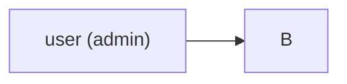
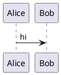
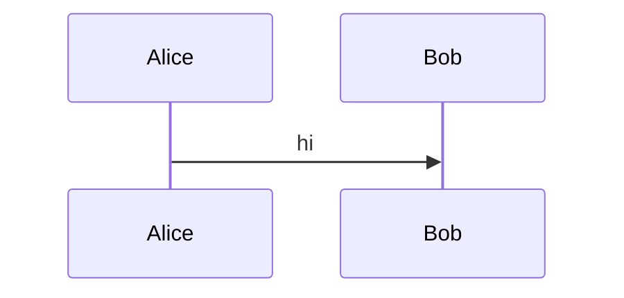

# Markdown gotchas — concrete failures with fixes

Every entry is a real failure mode the skill exists to prevent. Each shows the broken Markdown, what each renderer does with it, and the fix.

## 1. HTML block inside a list item — paragraph breaks the list

**Broken:**

```markdown
- item one
- item two
  <div>
    extra content
  </div>
- item three
```

**What happens:** Both renderers may end the list at `- item two` and treat the `<div>` as a top-level block. `- item three` starts a new, separate list.

**Fix:** Indent the HTML to match the list item's continuation indent (usually 2 or 4 spaces), and ensure no blank line immediately precedes a `<div>` unless you want a paragraph break:

```markdown
- item one
- item two

  <div>extra content</div>

- item three
```

The blank lines before and after the `<div>` make this a "loose list" — each item gets a `<p>` wrapper. The result is consistent across both renderers.

## 2. Code block inside a list item — wrong indentation

**Broken:**

```markdown
1. Step one.

```bash
echo hello
```

2. Step two.
```

**What happens:** The fenced code block is at column 0 and ends the list. Step two starts a new list (renumbered as `1.` on GH, possibly `2.` in IDE).

**Fix:** Indent the fence so it's a continuation of the list item:

```markdown
1. Step one.

    ```bash
    echo hello
    ```

2. Step two.
```

Four spaces of indent (matching the `1. ` prefix width) keeps the fence inside the list item. Both renderers agree.

## 3. Table cell with pipe

**Broken:**

```markdown
| command | description |
|---|---|
| `ls | grep foo` | list & filter |
```

**What happens:** The `|` inside the inline code splits the cell. GH renders three cells, last one truncated. JN does the same.

**Fix:** Escape pipes as `\|`, even inside code spans:

```markdown
| command | description |
|---|---|
| `ls \| grep foo` | list & filter |
```

For longer commands with many pipes, prefer a fenced code block outside the table and reference it with a cell like "see Example 3 below".

## 4. Math with adjacent whitespace

**Broken:**

```markdown
The price is $ 5 $ dollars and the formula is $ E = mc^2 $.
```

**What happens:** GitHub does not treat `$ 5 $` or `$ E = mc^2 $` as math because of the inner whitespace. Renders as literal `$ 5 $`. JN behavior depends on plugin version.

**Fix:**

```markdown
The price is \$5 dollars and the formula is $E = mc^2$.
```

`\$` for literal dollar; `$...$` with no inner whitespace for inline math.

## 5. Math block not on its own paragraph

**Broken:**

```markdown
Here is the integral: $$ \int_0^1 x \, dx = \tfrac{1}{2} $$ which equals one half.
```

**What happens:** Single-line `$$ … $$` inside flowing text — GitHub may interpret as inline math, may interpret as block math (depending on version), JN preview likewise inconsistent.

**Fix:** Separate the block math with blank lines:

```markdown
Here is the integral:

$$
\int_0^1 x \, dx = \tfrac{1}{2}
$$

which equals one half.
```

Always: block math gets its own paragraph.

## 6. Image with relative path from wrong directory

**Broken (file is `docs/intro.md`):**

```markdown

```

…where the image is at the repo root in `images/arch.png`.

**What happens:** Both renderers resolve `images/arch.png` relative to `docs/`, looking for `docs/images/arch.png`. Broken in both.

**Fix:** Use a path relative to the Markdown file (`../images/arch.png`) or an absolute-from-repo-root path (`/images/arch.png`):

```markdown

```

`/images/arch.png` works on GH and in some JN setups but is less portable when the file is consumed outside Git context — prefer relative.

## 7. Reference link with whitespace in ID

**Broken:**

```markdown
See [the docs][my docs].

[my docs]: https://example.com
```

**What happens:** GH normalizes (case-insensitive, spaces collapsed) and links correctly. JN' bundled plugin in some versions does not collapse the space, leaving `[the docs][my docs]` literal.

**Fix:** Use hyphenated or single-word IDs:

```markdown
See [the docs][my-docs].

[my-docs]: https://example.com
```

## 8. Heading with trailing punctuation — anchor mismatch

**Broken (writing a TOC):**

```markdown
## Setup (Linux)

…

See [setup](#setup).
```

**What happens:** GH slug: `setup-linux` (parentheses stripped, space → `-`). JN slug: similar. The link `#setup` doesn't match.

**Fix:** Either match the slug:

```markdown
See [setup](#setup-linux).
```

…or use an explicit anchor for full control:

```markdown
<a id="setup"></a>
## Setup (Linux)

…

See [setup](#setup).
```

## 9. Front matter on a non-Jekyll README

**Broken:**

```markdown
---
title: My Project
author: alice
---

# My Project

…
```

**What happens:** GH repo view shows a horizontal-rule-bounded section containing `title: My Project author: alice` as plain text. Looks like a styling glitch. JN preview hides the block correctly (as YAML). Result: looks fine in the IDE, looks broken on GitHub.

**Fix:** Remove front matter unless the file is consumed by Jekyll/GitHub Pages or another front-matter-aware tool:

```markdown
# My Project

…
```

For metadata you want stored but not rendered, use HTML comments:

```markdown
<!--
title: My Project
author: alice
-->

# My Project
```

## 10. Nested blockquote vs. alert

**Broken (GitHub-side intent: a normal nested quote):**

```markdown
> Outer quote.
> > Inner quote.
```

**What happens:** Renders as nested blockquote on both. Fine.

**But:** If the inner first line happens to be `[!NOTE]`-shaped:

```markdown
> Outer note.
> > [!NOTE]
> > Inner alert.
```

GH does **not** interpret the inner as an alert because alerts must be at the top level of a blockquote, not nested. Both renderers show a nested blockquote with literal `[!NOTE]`. Confusing because the syntax looks valid.

**Fix:** Don't nest alerts. Put the alert at top level and put its context inline.

## 11. Bare URL inside parentheses

**Broken:**

```markdown
For more info (see https://example.com/foo) check the page.
```

**What happens:** GH autolinks `https://example.com/foo)` **including the closing paren**. Click goes to a 404. JN doesn't autolink at all, prints plain text.

**Fix:** Use explicit autolink syntax:

```markdown
For more info (see <https://example.com/foo>) check the page.
```

Or a labeled link:

```markdown
For more info ([example](https://example.com/foo)) check the page.
```

## 12. Mermaid label containing special characters

**Broken:**

````markdown
```mermaid
flowchart LR
  A[user (admin)] --> B
```
````

**What happens:** Mermaid parser fails on the unescaped `()` inside `[...]`. Both renderers show "syntax error in graph".

**Fix:** Quote the label:

````markdown

````

Same applies to labels containing `:`, `;`, `{}`, `<>`, or commas — quote them.

## 13. Any non-Mermaid diagram DSL in a code fence

**Broken (PlantUML example, but the same applies to `dot`, `d2`, `graphviz`, `tikz`, drawio embeds, etc.):**

````markdown

````

**What happens:** Renders as a UML diagram in the IDE (with the PlantUML extension/plugin). Renders as a plain text code block on GitHub. The diff between the two views is exactly the failure this skill is designed to prevent.

**Policy: Mermaid is the only diagram DSL this skill permits. PlantUML, DOT, D2, TikZ, drawio source fences — forbidden.** If the user requests one of these explicitly, refuse it (one sentence), then convert. Do not propose a "keep PlantUML for IDE, image for GitHub" hybrid; do not propose a PlantUML proxy server URL; do not leave the source DSL in a code fence. Pick one of the two fixes below.

**Fix (preferred):** Convert to Mermaid. Mermaid covers sequence, class, state, ER, flowchart, gantt, pie, mindmap, journey, timeline, quadrant, sankey, gitGraph, and C4 (limited):

````markdown

````

**Fix (when Mermaid genuinely cannot express the diagram):** Pre-render the source to SVG or PNG, commit the rendered image, and embed via a normal image link. **Never commit the source DSL inside a code fence in the rendered Markdown.** Keep the source file (e.g. `.puml`, `.dot`) alongside the image for future edits, but the Markdown reader only ever sees the image:

```markdown

```

A `make diagrams` target or a CI step regenerates the images when the source changes.

## 14. Hard line break ambiguity

**Broken:** User expects this to render on two lines:

```markdown
First line.
Second line.
```

**What happens:** Both renderers join into one line with a space separator. CommonMark spec — a single newline is whitespace, not a line break.

**Fix:** Use one of the two GFM-supported hard-break syntaxes:

```markdown
First line.<space><space>
Second line.
```

(two trailing spaces — invisible in many editors; configure the editor to show whitespace)

Or:

```markdown
First line.\
Second line.
```

(backslash at end of line). Both work on GH and in JN.

Or, often clearer, just use a paragraph break (blank line). Hard breaks are a code smell — usually a sign that the content wants to be a list or separate paragraphs.

## 15. `<br>` inside list item

**Broken:**

```markdown
- first item<br>continuation
- second item
```

**What happens:** Mostly works on both renderers, but JN may add unexpected vertical spacing depending on preview CSS.

**Fix:** Prefer continuation lines with proper indent:

```markdown
- first item
  continuation
- second item
```

`<br>` inside list items is fine for short cases but indented continuation lines are more idiomatic Markdown.
